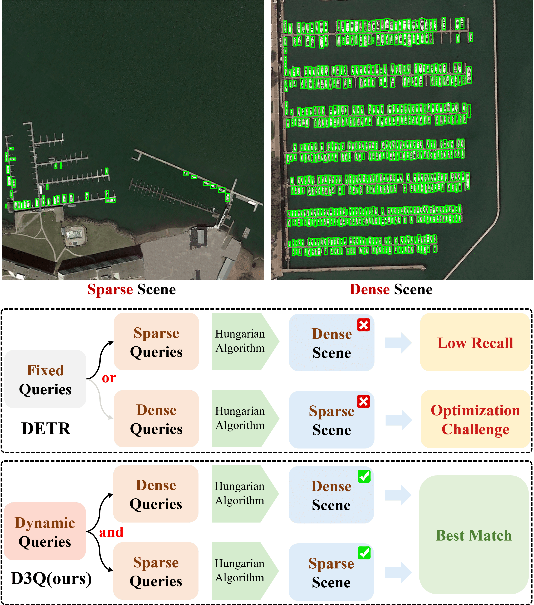

# mmdet3-D3Q
This is the official implementation of the JSTARS paper "Density-Aware DETR With Dynamic Query for End-to-End Tiny Object Detection". [IEEE xplore](https://ieeexplore.ieee.org/abstract/document/11007261)

## :white_check_mark: Updates
* **`Nov. 4th, 2025`**: Update: codes released.

## Introduction
To address the issue in fixed set prediction, we devise a novel
approach called density-aware DETR with dynamic query. This
method can be easily integrated as a plug-in for various DETR-based methods to improve tiny object detection performance.

**Abstract**: End-to-end DEtection TRansformer (DETRs) are leading a new trend in various object detection tasks. However, when it comes to the ubiquitous tiny objects in aerial imagery, the potential of DETRs still remains under-explored. In this work, we observe that the expansive field of view of remote sensing images often results in a limited pixel representation of tiny objects coupled with a substantial variance in the number of instances across images. The significantly varied tiny object number per image conflicts with DETRs' fixed set of object queries. A large number of queries are necessary to ensure high recall in dense scenarios, while sparse scenarios benefit from fewer, more distinct queries. To tackle this issue, we propose a Density-aware DETR with Dynamic Query (D3Q). D3Q adaptively determines the optimal number of object queries for each image by explicitly estimating its object density. This dynamic query mechanism enables efficient and accurate tiny object detection under both dense and sparse object distributions. In addition, we introduce a refined box loss designed for tiny object detection that further stabilizes training. Through these strategies, D3Q effectively adapts to both dense and sparse scenarios, overcoming the limitations of fixed query in DETR. Extensive experiments on challenging tiny object detection benchmarks demonstrate the superior performance of D3Q compared to state-of-the-art methods. Particularly, when integrated with DINO, D3Q achieves an impressive 32.1% mAP on the AI-TOD-v2 dataset, setting a new state-of-the-art performance.




## Installation and Get Started

Required environments:
* Linux
* Python 3.8+
* PyTorch 2.1+
* CUDA 11.8+
* GCC 5+
* [cocoapi-aitod](https://github.com/jwwangchn/cocoapi-aitod)


Install:

Note that this repository is based on the [MMDetection](https://github.com/open-mmlab/mmdetection).

```shell script
git clone https://github.com/XianHYe/mmdet3-D3Q.git
cd mmdet3-D3Q

conda create --name d3q python=3.8 -y
conda activate d3q
conda install pytorch==2.1.1 torchvision==0.16.1 torchaudio==2.1.1 pytorch-cuda=11.8 -c pytorch -c nvidia
pip install -U openmim
mim install mmengine
mim install "mmcv==2.1.0"

# Install cocoapi
pip install numpy==1.23.5
pip install cython==0.29.35
pip install "git+https://github.com/jwwangchn/cocoapi-aitod.git#subdirectory=aitodpycocotools"

pip install -v -e .
```

## Preparation

- Please refer to [AI-TOD](https://github.com/Chasel-Tsui/mmdet-aitod) for AI-TOD-v2.0 and AI-TOD-v1.0 dataset.
- Download the pretrained models at [Baidu Netdisk](https://pan.baidu.com/s/1Gv6mOK2TlA3b0L8fPJ8_GQ?pwd=ec8t) code: ec8t. Move to pretrained_model folder.


## Training
Modify the dataset path in [dataset config](configs/_base_/datasets/aitodv2_detection.py). 

- To train D3Q on AI-TOD-v2.0, run

```shell script
# For deformable-detr with d3q
python tools/train.py configs/d3q/deformable-detr_d3q_aitodv2.py

# For dino with d3q
python tools/train.py configs/d3q/dino_d3q_aitodv2.py

# For dino-d3q from pretrained weights
python tools/train.py configs/d3q/dino_d3q_from_pretrain_aitodv2.py
```

- Due to GPU memory constraints, the DINO-based models only support a 1 batchsize. We recommend using multi-GPU training to improve training stability, run

```shell script
# For dino with d3q
CUDA_VISIBLE_DEVICES=0,1 python tools/dist_train.py configs/d3q/dino_d3q_aitodv2.py 2

# For dino-d3q from pretrained weights
CUDA_VISIBLE_DEVICES=0,1 python tools/dist_train.py configs/d3q/dino_d3q_from_pretrain_aitodv2.py 2
```

## Inference
- Run
```
python tools/test.py configs/d3q/dino_d3q_aitodv2.py pretrained_model/dino_d3q.pth
```

## Main Results
Table 1. **Training Set:** AI-TOD trainval set, **Validation Set:** AI-TOD test set. [AI-TOD dataset](https://github.com/jwwangchn/AI-TOD)
Method | Backbone | mAP | AP<sub>50</sub> | AP<sub>75</sub> |AP<sub>vt</sub> | AP<sub>t</sub>  | AP<sub>s</sub>  | AP<sub>m</sub> 
--- |:---:|:---:|:---:|:---:|:---:|:---:|:---:|:---:
HANet | R-50 | 22.1 | 53.7 | 14.4 | 10.9 | 22.2 | 27.3 | 36.8 
FSENet | CSPDarkNet-s | 22.8 | - | 12.1 | - | 24.6 | 27.0 | - 
HS-FPN | R-50-FPN | 25.1 | 55.7 | 19.1 | 12.1 | 25.3 | 29.9 | 36.9
DFEM | - | 28.4 | 59.1 | 21.3 | 11.0 | 26.2 | 32.1 | 40.6
BAFNet | R-50 | 30.5 | 59.8 | 26.6 | 16.6 | 31.3 | 35.1 | 40.5
DINO-D3Q | R-50 | **33.0** | **67.6** | **27.0** | **19.6** | **33.9** | **37.6** | **43.8** 

Table 2. **Training Set:** AI-TOD-v2 trainval set, **Validation Set:** AI-TOD-v2 test set. [AI-TOD-v2 dataset](https://chasel-tsui.github.io/AI-TOD-v2/)
Method | Backbone | mAP | AP<sub>50</sub> | AP<sub>75</sub> |AP<sub>vt</sub> | AP<sub>t</sub>  | AP<sub>s</sub>  | AP<sub>m</sub> 
--- |:---:|:---:|:---:|:---:|:---:|:---:|:---:|:---:
FFCA-YOLO | CSPDarkNet53 | 26.0 | 61.4 | 17.3 | 12.7 | 26.2 | 31.2 | 34.6
DEF-DETR | R-50 | 17.8 | 45.1 | 10.8 | 5.4 | 17.2 | 23.5 | 32.2 
DNTR | R-50-FPN | 24.2 | 53.4 | 17.9 | 10.3 | 24.2| 28.0 | 36.6 
DINO | R-50 | 28.5 | 61.0 | 22.6 | 14.1 | 29.0 | 33.1 | 39.5
DQ-DETR* | R-50 | 30.2 | **68.6** | 22.3 | 15.4 | 30.5 | 36.5 | 44.6 
DEF-DETR-D3Q | R-50 | 23.9 | 55.4 | 16.6 | 11.3 | 24.3 | 27.9 | 35.2 
DINO-D3Q | R-50 | 30.2 | 62.9 | 24.4 | 16.0 | 30.4 | 34.7 | 42.2 
DINO-D3Q* | R-50 | **32.1** | 67.0 | **25.9** | **17.3** | **32.7** | **36.5** | **46.1**


## Visualization
The images are from the AI-TOD, VisDrone2019 and DOTA-v2 datasets. Note that the <font color=green>green box</font> denotes the True Positive, the <font color=red>red box</font> denotes the False Negative and the <font color=blue>blue box</font> denotes the False Positive predictions.


## Citation
If you find this work helpful, please consider citing:
```bibtex
@ARTICLE{ye2025density,
  title={Density-Aware DETR With Dynamic Query for End-to-End Tiny Object Detection}, 
  author={Ye, Xianhang and Xu, Chang and Zhu, Haoran and Xu, Fang and Zhang, Haijian and Yang, Wen},
  journal={IEEE Journal of Selected Topics in Applied Earth Observations and Remote Sensing}, 
  year={2025},
  volume={18},
  pages={13554-13569},
}
```